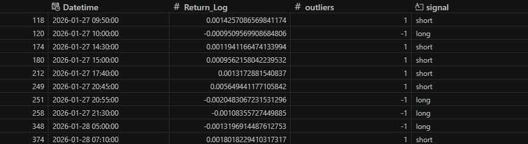
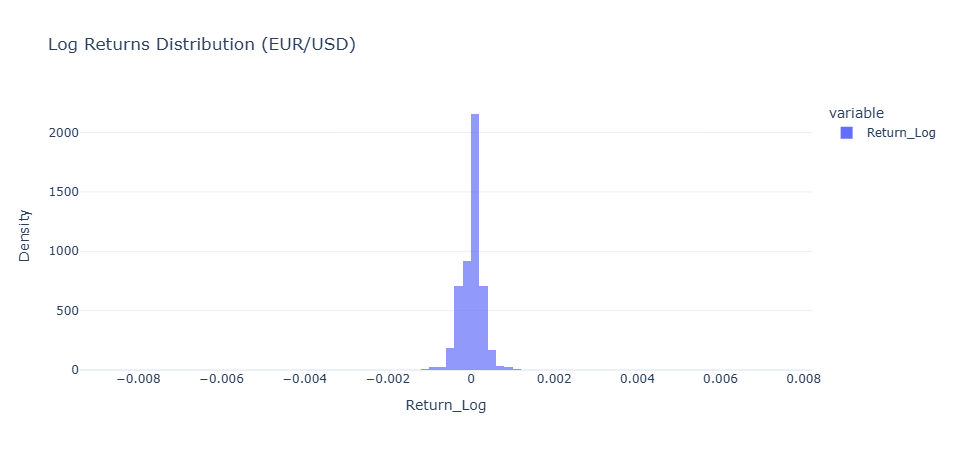
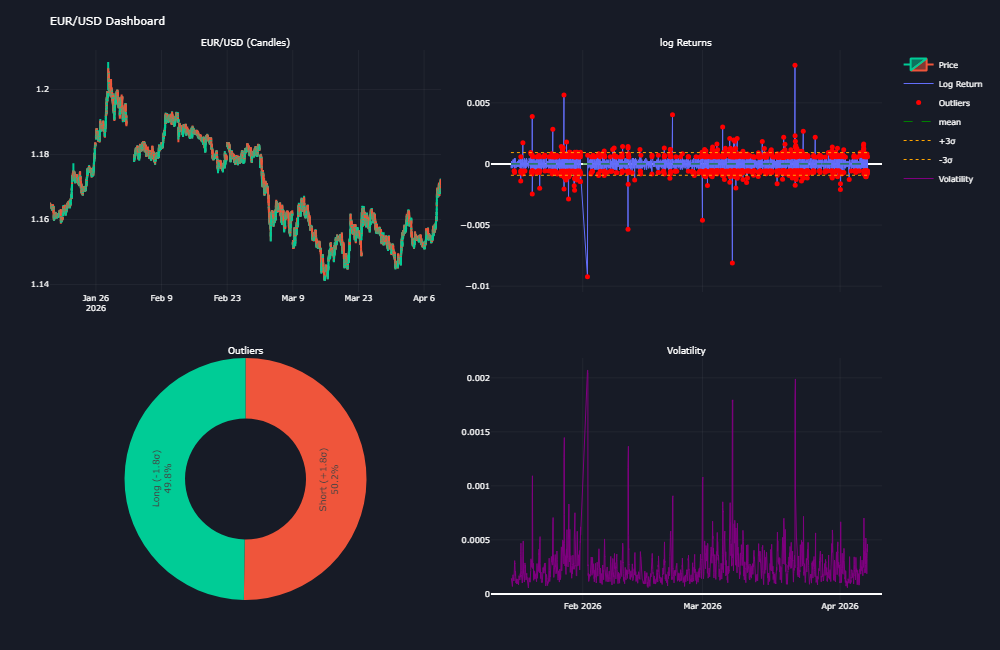
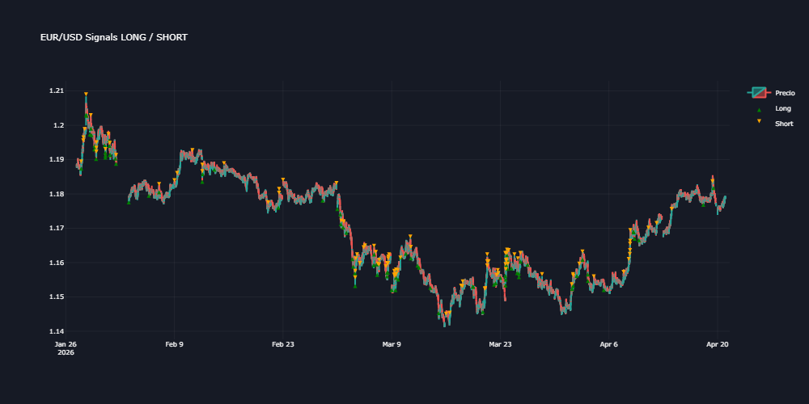

# Outlier Detection in EUR/USD (5-Min Data)

## Project Overview
This project analyzes the EUR/USD exchange rate at 5-minute intervals to detect extreme returns (outliers) using a statistical approach based on standard deviations. These extreme events are transformed into discrete trading signals within a DataFrame.

---

## Problem Defintion
How to detect extreme log returns (±3 standard deviations) in EUR/USD 5-minute data and convert them into discrete trading signals within a DataFrame?

---

## Data Collection & Preparation
- Data source: Yahoo Finance (EUR/USD, 5-minute timeframe)
- Selected variable: Close price
- Data transformation:
  - Converted price series into log returns
- Data structure:
  - Organized into a pandas DataFrame for analysis

---

### Dataframe

## Exploratory Data Analysis
- Visualized log returns over time
- Built a histogram to analyze distribution
- Identified extreme values visually
- Calculated and plotted volatility to observe its behavior over time

> Note: No formal statistical validation of stationarity or variance stability was performed.

---

### Outliers Distribution

## Modeling Approach
A statistical model based on standard deviation thresholds was implemented:

- Computed mean (μ) and standard deviation (σ) of log returns
- Defined thresholds:
  - Upper bound: μ + 3σ
  - Lower bound: μ - 3σ

- Classification rules:
  - **1** → return > μ + 3σ → sell signal
  - **-1** → return < μ - 3σ → buy signal
  - **0** → normal behavior

---
### Outliers Dashboard

## Implementation
The model was applied directly to the DataFrame:

- Compared each log return against upper and lower thresholds
- Created a new column with discrete signals:
  - 1 (sell), -1 (buy), 0 (neutral)
- Integrated signals into the dataset
- Visualized anomalies on the time series
### Candles and signals

---

## Insights & Decisions
- Extreme values (±3σ) represent statistically rare events
- These events visually coincide with periods of increased volatility
- Signals derived from these anomalies can be used as a basis for quantitative strategies

⚠️ These signals alone do not constitute a complete trading system and require additional components such as risk management and execution rules.

---

## Evaluation & Validation

### Strengths
- Simple and interpretable model
- Clear identification of extreme events

### Limitations
- Assumes approximate normality of returns
- No formal statistical validation performed
- No backtesting included
- Does not consider external market factors
- Signals may be noisy or produce false positives

### Considerations
- Observed volatility could be incorporated into future improvements
- A full trading system would require risk management and exit strategies

---

---

## Technologies Used
- Python
- Pandas
- NumPy
- Matplotlib / Seaborn

---

## How to Run

git clone https://github.com/Chris17cas/outliers_returns.git
cd outliers_returns
pip install -r requirements.txt
